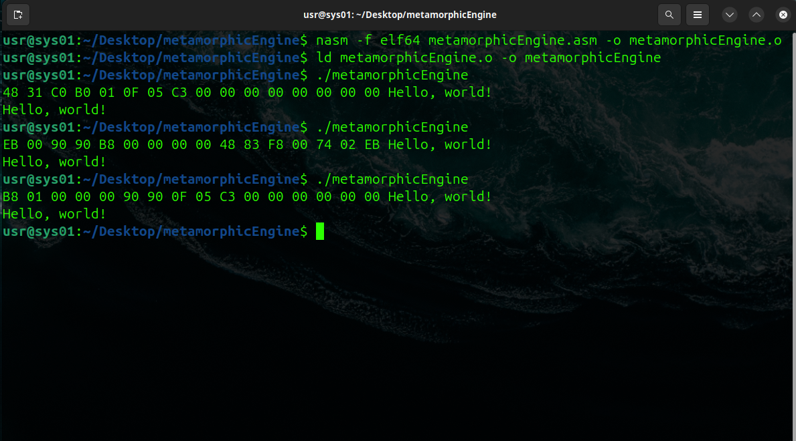

# metamorphic-engine

Pure x86_64 assembly **metamorphic engine** demo. Outputs “Hello, world!” while the underlying binary changes on each run.

## Overview

This project demonstrates a simple metamorphic engine written entirely in NASM x86_64 assembly. Each execution produces identical output (`Hello, world!`) but modifies its machine code using techniques like:

- Register shuffling  
- Dead code sequences that clean up themselves  
- Control-flow variation  
- Instruction permutation

It’s designed for **learning, experimentation, and demo purposes**. Safe to run in a VM environment.

## Ubuntu Setup
sudo apt install -y nasm build-essential

## Demo
Build and run:

nasm -f elf64 metamorphicEngine.asm -o metamorphicEngine.o
ld metamorphicEngine.o -o metamorphicEngine

./metamorphicEngine
